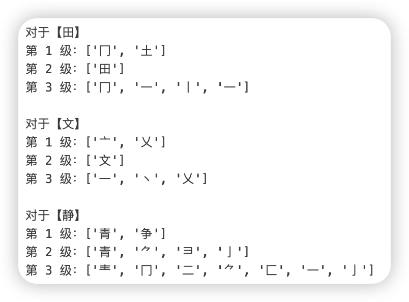

# 汉字拆字

> 在研究 GAN 做书法家字生成时，发现很多论文都提到将字拆分成笔画或部首，但很多代码都没提。


本项目将[hanzi](https://github.com/nieldlr/hanzi)该部分内容提取了出来，使用Python写了个工具类以便快速使用。
基本上涵盖了所有的简繁字，总计72042个字。

用法：
```
from hanzi_components import HanziComponents

hc = HanziComponents()
hc.components('中', level=1) # level只能是1，2，3
```



【部分】提到拆字论文：  
[CalliGAN: Style and Structure-aware Chinese Calligraphy Character Generator](http://arxiv.org/abs/2005.12500)  
[Few-shot Font Generation with Localized Style Representations and Factorization](http://arxiv.org/abs/2009.11042)  
[StrokeGAN: Reducing Mode Collapse in Chinese Font Generation via Stroke Encoding](http://arxiv.org/abs/2012.08687)  
[FontRL: Chinese Font Synthesis via Deep Reinforcement Learning](https://ojs.aaai.org/index.php/AAAI/article/view/16318)  
[Few-shot Font Generation with Weakly Supervised Localized Representations](http://arxiv.org/abs/2112.11895)  
[StrokeGAN+: Few-Shot Semi-Supervised Chinese Font Generation with Stroke Encoding](http://arxiv.org/abs/2211.06198)  
